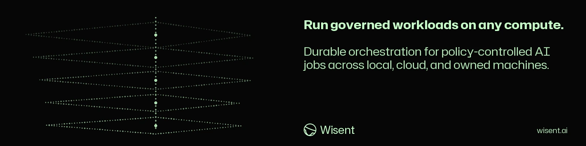

<!-- wisent-banner:start -->
<p align="center">
  
</p>
<!-- wisent-banner:end -->

<!-- wisent-readme-signals:start -->
[](https://github.com/wisent-ai/stado) [](https://github.com/wisent-ai/stado/issues) [](https://wisent.com) [](https://discord.gg/qRjpkthq54) [](https://www.linkedin.com/company/wisent-ai/) [](https://x.com/wisentai) [](https://calendly.com/lbartoszcze)
<!-- wisent-readme-signals:end -->

# Stado: The Easiest Harness for Managing Compute and Storage Across Local, GCP, AWS, and Azure Infrastructure

Stado Is the AI DevOps and Infrastructure Hire You Needed.

Your AI is super smart but confined to your computer. Stado is the missing
harness it needs to set up and manage civilisation-level infrastructure.

Spin up experiments in seconds on a dedicated GPU. Manage GCP, Azure and AWS
services from one intuitive client. Rent your local devices. Optimise storage and
migrate services across locations. Dozens of providers. Millions in available
hardware. All accessible through one simple client.

Give your AI the muscle it needs.

[Quick start](#quick-start) · [Native builds](https://stado.wisent.com/docs/builds) ·
[CLI reference](https://stado.wisent.com/docs/cli) · [Architecture](https://stado.wisent.com/docs/architecture) ·
[Operations](https://stado.wisent.com/docs/operations) ·
[Checks that measure nothing](https://stado.wisent.com/docs/checks-that-measure-nothing)

Current proof boundary: the 0.5 contract has a stable local-filesystem execution
scope for macOS arm64 and Linux amd64 release candidates. Cloud storage and VM
adapters remain preview until their release-scoped live acceptance evidence is
recorded.

This page is the front door. Every operator contract — commands, arguments,
refusals, primitives, channels, host operations, capabilities and their
evidence — is published at [stado.wisent.com/docs](https://stado.wisent.com/docs),
generated from this source, so nothing here restates it a second time.

## Problem and intended users

AI compute fleets usually grow as disconnected local workstations, long-lived
servers, cloud VMs, provider consoles, scripts, queues, artifact stores, and
billing dashboards. The result is expensive capacity that is difficult to
schedule, difficult to recover, and dangerous to automate.

Stado serves three audiences:

- **Infrastructure operators** need one place to admit machines, control
  mutations, observe health, pause work, recover state, and account for cost.
- **AI workload owners** need reproducible execution, explicit resource and
  deadline constraints, immutable inputs, scoped secrets, and durable results.
- **Automation and AI agents** need stable JSON contracts and bounded
  capabilities instead of shell access or cloud-administrator credentials.

Stado replaces ad hoc orchestration with a provider-neutral product contract:
describe the workload, required capacity, deadline, data, and budget; Stado
decides where and when to run it, then records what happened.

## Product boundaries

### Included in the 0.5 product contract

- a provider-neutral queue and job lifecycle;
- local workers on registered workstations and servers;
- prompt-free preparation and observed readiness of the signed Apple code-capture
  helper on a registered Mac, through both the CLI and the native Hosts screen
  ([Apple preparation](https://stado.wisent.com/docs/desktop#prepare-apple-code-capture));
- local filesystem queue/storage as the stable 0.5 execution path;
- GCS, S3, and Azure Blob queue/storage adapters released as preview until
  their release-scoped live sandbox suites pass;
- ephemeral VM lifecycle adapters for GCP, Azure, and AWS released as preview
  until their release-scoped live acceptance suites pass;
- externally managed Box capacity and Vast-host execution with the capability
  limits reported by `stado capabilities`;
- leases, compare-and-swap writes, fencing, pause, drain, recovery, and
  storage migration;
- immutable artifacts, result manifests, lineage, and scoped secret references;
- cost, capacity, quota, inventory, health, and ownership evidence where the
  selected provider adapter declares support;
- a human CLI, versioned machine JSON interface, native macOS Desktop, and
  read-only MCP interface; Desktop uses `WisentDesignSystem` from
  `wisent-ai/wisent-components` for its visual tokens and SwiftUI primitives;
- a loopback mobile-egress proxy whose upstream sockets are pinned to a named
  tether interface and whose process lifecycle is managed as a Stado service.

### Explicit non-goals for 0.5

- Stado is not a general Kubernetes replacement or a container platform.
- Stado does not manage arbitrary networks, load balancers, registries, or
  application platforms.
- Stado does not promise identical capabilities for every provider.
- Azure VM Scale Sets and AWS Auto Scaling are planned, not supported managed
  compute adapters.
- GCP managed instance groups are partial and are not part of the stable 0.5
  contract.
- Local hosts are attached and scheduled; Stado does not provision physical
  machines or install their operating systems, GPU drivers, or workload
  runtimes.
- Stado does not make an optional provider, alert channel, dashboard identity
  provider, or artifact service mandatory for local execution.

### Supported environments

The release manifest is authoritative for binary support. The initial release
matrix targets:

| Role | Platform | Status |
|---|---|---|
| Control plane and local agent | macOS arm64 | supported candidate; stable local scope |
| Control plane and local/cloud agent | Linux amd64 | supported candidate; cloud adapters remain preview |
| Control plane and agent | Linux arm64 | not yet supported |
| Workload GPU runtime | NVIDIA/AMD or CPU-only | supplied by the worker host or immutable workload image |

Cloud adapters require operator-provisioned accounts, networks, identities,
quotas, and storage. Stado mutates only resources admitted by its configured
ownership and policy boundaries.

### Capability status

`stado capabilities --json` is the source of truth for the installed build:
`implemented` means the adapter code implements the declared contract,
`partial` that only the stated subset is available, `external` that Stado
consumes or observes a dependency it does not manage, `planned` that the
capability is not available, and `unsupported` that no contract exists. An
implementation status does not promote an integration to stable; stable
provider support additionally requires the live acceptance evidence described
in the [release documentation](https://stado.wisent.com/docs/release).

## Core use cases

Each of these is documented end to end, with its exact commands and refusals,
under [Examples](https://stado.wisent.com/docs/examples) and
[Onboarding](https://stado.wisent.com/docs/onboarding):

- run a workload on a machine that already exists, with a declared deadline,
  capacity requirement and budget;
- attach a workstation or server to a fleet by `invite`, `adopt`, `join` or
  `declare`, without an operator session on the machine;
- rent out local capacity, and schedule work onto externally managed capacity;
- migrate a queue or object store between backends without losing job state;
- pause, drain, fence and recover a fleet whose host or provider went quiet;
- account for cost, quota and capacity where the provider adapter reports them.

## How Stado works

A workload is a declaration, not a script: the request names its command,
inputs, capacity, deadline and budget, and Stado decides where it runs.
Placement reads the fleet's published capacity, the host's own admission
decision and the declared policy; execution is leased and fenced; results and
their evidence are immutable objects addressed by a durable job key.
[Architecture](https://stado.wisent.com/docs/architecture) maps the systems and
their boundaries, and [Primitives](https://stado.wisent.com/docs/primitives/job)
defines each one: job, lease, registry, target, policy, observation, beacon,
grant, directory, object store and release.

## Quick start

This path uses local storage and an existing local machine. It does not require
a cloud account, cloud credential, Skarbiec, GPU, or Python. It needs a
supported Stado binary from an immutable release, a POSIX shell, permission to
create `~/.stado`, and whatever runtime the workload itself requires.

Install an exact verified release before following the
[complete onboarding path](https://stado.wisent.com/docs/onboarding). A machine
joins a fleet by one of four methods — `invite` (send a fragment, or a one-line
code where the control point is published; touch nothing either way), `adopt`
(Stado installs the key over a session you already have), `join` (the machine
announces itself) and `declare` (assert the entry, verify later) — all four
listed by `stado fleet methods` and described under
[Onboard another machine](https://stado.wisent.com/docs/onboarding#onboard-another-machine).
In every one of them the private half of the channel key stays in the operator's
credential store and only the public line reaches the machine. If you are
attaching your own computer to a fleet someone else operates, read
[Add your own machine](https://stado.wisent.com/docs/add-your-machine) instead.
For source development only, install Rust and Cargo and build from `stado-rs/`.

### 1. Create the minimal local configuration

```bash
stado config init
stado config validate
```

Expected result:

```text
~/.stado/config.json
config ok (~/.stado/config.json)
```

The generated profile selects provider `local`, queue storage
`~/.stado/local-storage`, backup storage `~/.stado/local-backup`, and a
loopback-only dashboard.

### 2. Start the local control plane

```bash
stado local-control-plane
```

Expected result: the coordinator, local agent, and dashboard remain running.
The dashboard listens on `http://127.0.0.1:8765`.

### 3. Submit a job from another terminal

```bash
stado submit --run-id quickstart-hello "printf 'hello from Stado\n'"
```

`--run-id` is a required caller-retained retry identity. Reusing it with the
same request recovers the original job; use a new value for intentional new work.
The final output line is a `stado.submission-receipt.v3` JSON object. Each job
binds its exact command SHA-256, durable job key, output URI, pinned host, and
resolved executor projection to the request/source/input digests.

The command prints a `Job ID`. Use it below:

```bash
stado status JOB_ID
stado results JOB_ID ./results
```

Expected result: the job reaches `completed` and `./results` contains its
command output and result evidence.

If any step fails, run `stado doctor --fix-hints` and follow the
[onboarding failure guidance](https://stado.wisent.com/docs/onboarding#failure-guidance).
Do not add cloud credentials to make the local path work.

## Primary interfaces

`stado` is the canonical operator command; `wc` is a compatibility alias for
existing deployments. The four surfaces carry the same capabilities:

- **Human CLI** — every command, argument, refusal sentence and exit code is
  published in the [CLI reference](https://stado.wisent.com/docs/cli), generated
  from the built binary rather than written by hand.
- **Machine JSON interface** — versioned schemas for automation and agents:
  [machine interface](https://stado.wisent.com/docs/machine-interface).
- **Native macOS Desktop** — the same operations with the same receipts:
  [Stado Desktop](https://stado.wisent.com/docs/desktop).
- **Read-only MCP** — bounded reads for an AI client:
  [integrations](https://stado.wisent.com/docs/integrations).

Host and service work — bounded vault bearers, retiring an undeclared init
system unit, connection paths, forwards and the mobile egress proxy — is
documented under [Channels](https://stado.wisent.com/docs/channels) and
[Host connections](https://stado.wisent.com/docs/capabilities/host-connections).

## Operational model

Stado records what happened rather than asserting that it worked. The published
operator pages carry each contract in full:

- [Operations](https://stado.wisent.com/docs/operations) — host health
  publication, service reconciliation, storage-root handoff and disk cleanup;
- [Host space](https://stado.wisent.com/docs/capabilities/space) and
  [host memory](https://stado.wisent.com/docs/capabilities/host-memory) — the
  declared watermarks a host is measured against, and the refusals they produce;
- [Release and compatibility](https://stado.wisent.com/docs/release) — one
  version, one build, immutable publication, promotion and rollback;
- [Runbook](https://stado.wisent.com/docs/runbook) and
  [disaster recovery](https://stado.wisent.com/docs/disaster-recovery) — what to
  read and do when a host, provider or store goes quiet;
- [Security](https://stado.wisent.com/docs/security) and
  [configuration](https://stado.wisent.com/docs/configuration) — credential
  boundaries, scoped grants and what never reaches a command line;
- [Costs](https://stado.wisent.com/docs/costs) and
  [providers](https://stado.wisent.com/docs/providers) — what each adapter
  reports, and what it does not.

## Project status and support

Stado 0.5 is in release-candidate validation. The Rust control plane, CLI,
agents, local workflow, four storage backends, and cloud VM adapters exist.
Stable 0.5 support is intentionally limited to the local execution and local
filesystem contracts; every cloud adapter remains preview until its own
release-scoped live acceptance matrix passes. Provider status printed by the
installed build remains authoritative.

Compatibility before 1.0: persisted formats and machine schemas are versioned
and migrated deliberately; a minor release may add fields and capabilities;
incompatible behavior requires release notes and an explicit migration; preview
integrations may change within the documented compatibility range.

Support: operational and product defects through
[GitHub Issues](https://github.com/wisent-ai/stado/issues); security
vulnerabilities through a private
[GitHub Security Advisory](https://github.com/wisent-ai/stado/security/advisories/new)
rather than a public issue; release, compatibility and rollback policy at
[stado.wisent.com/docs/release](https://stado.wisent.com/docs/release).

Stado is licensed under the Apache License 2.0. See [LICENSE](LICENSE).
