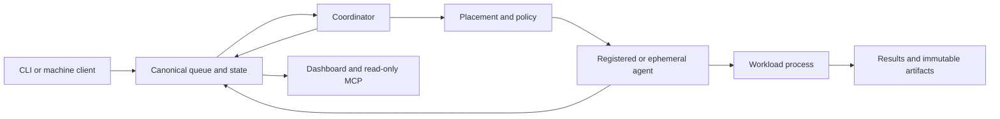

# Stado

<!-- wisent-readme-signals:start -->
[](https://github.com/wisent-ai/stado/releases)
[](https://github.com/wisent-ai/stado/releases)
[](https://github.com/wisent-ai/stado)
[](https://discord.gg/qRjpkthq54)
<!-- wisent-readme-signals:end -->


**Stado is a self-hosted compute fleet control plane for teams that need to run
policy-controlled AI workloads across machines they own or explicitly
authorize.**

Stado accepts the result a workload must produce and the constraints it must
respect, assigns eligible capacity through one durable queue, preserves result
evidence, and enforces explicit cost, ownership, and safety boundaries.

[Quick start](#quick-start) · [CLI reference](docs/cli.md) ·
[Architecture](docs/architecture.md) · [Operations](docs/operations.md)

Current proof boundary: the 0.5 contract has a stable local-filesystem execution
scope for macOS arm64 and Linux amd64 release candidates. Cloud storage and VM
adapters remain preview until their release-scoped live acceptance evidence is
recorded.

## Problem and intended users

AI compute fleets usually grow as disconnected local workstations, long-lived
servers, cloud VMs, provider consoles, scripts, queues, artifact stores, and
billing dashboards. The result is expensive capacity that is difficult to
schedule, difficult to recover, and dangerous to automate.

Stado serves three audiences:

- **Infrastructure operators** need one place to admit machines, control
  mutations, observe health, pause work, recover state, and account for cost.
- **AI workload owners** need reproducible execution, explicit resource and
  deadline constraints, immutable inputs, scoped secrets, and durable results.
- **Automation and AI agents** need stable JSON contracts and bounded
  capabilities instead of shell access or cloud-administrator credentials.

Stado replaces ad hoc orchestration with a provider-neutral product contract:
describe the workload, required capacity, deadline, data, and budget; Stado
decides where and when to run it, then records what happened.

## Product boundaries

### Included in the 0.5 product contract

- a provider-neutral queue and job lifecycle;
- local workers on registered workstations and servers;
- local filesystem queue/storage as the stable 0.5 execution path;
- GCS, S3, and Azure Blob queue/storage adapters released as preview until
  their release-scoped live sandbox suites pass;
- ephemeral VM lifecycle adapters for GCP, Azure, and AWS released as preview
  until their release-scoped live acceptance suites pass;
- externally managed Box capacity and Vast-host execution with the capability
  limits reported by `stado capabilities`;
- leases, compare-and-swap writes, fencing, pause, drain, recovery, and
  storage migration;
- immutable artifacts, result manifests, lineage, and scoped secret
  references;
- cost, capacity, quota, inventory, health, and ownership evidence where the
  selected provider adapter declares support;
- a human CLI, versioned machine JSON interface, dashboard, and read-only MCP
  interface.

### Explicit non-goals for 0.5

- Stado is not a general Kubernetes replacement or a container platform.
- Stado does not manage arbitrary networks, load balancers, registries, or
  application platforms.
- Stado does not promise identical capabilities for every provider.
- Azure VM Scale Sets and AWS Auto Scaling are planned, not supported managed
  compute adapters.
- GCP managed instance groups are partial and are not part of the stable 0.5
  contract.
- Local hosts are attached and scheduled; Stado does not provision physical
  machines or install their operating systems, GPU drivers, or workload
  runtimes.
- The Swift desktop application is not a required 0.5 operations interface.
  The CLI, machine API, dashboard, and MCP contracts are canonical.
- Stado does not make an optional provider, alert channel, dashboard identity
  provider, or artifact service mandatory for local execution.

### Supported environments

The release manifest is authoritative for binary support. The initial release
matrix targets:

| Role | Platform | Status |
|---|---|---|
| Control plane and local agent | macOS arm64 | supported candidate; stable local scope |
| Control plane and local/cloud agent | Linux amd64 | supported candidate; cloud adapters remain preview |
| Control plane and agent | Linux arm64 | not yet supported |
| Workload GPU runtime | NVIDIA/AMD or CPU-only | supplied by the worker host or immutable workload image |

Cloud adapters require operator-provisioned accounts, networks, identities,
quotas, and storage. Stado mutates only resources admitted by its configured
ownership and policy boundaries.

### Capability status

`stado capabilities --json` is the source of truth for the installed build.
Its statuses have precise meanings:

- `implemented` — the adapter code implements the declared contract;
- `partial` — only the stated subset is available;
- `external` — Stado consumes or observes a dependency but does not manage it;
- `planned` — the capability is not available;
- `unsupported` — no contract exists.

An implementation status does not promote an integration to stable. Stable
provider support additionally requires the live acceptance evidence described
in the release documentation.

## Core use cases

### Run a workload on an existing machine

- **Actor:** an operator and a workload owner.
- **Initial state:** the operator has registered a workstation or server and
  started an agent with the required runtime and capacity.
- **Outcome:** the owner submits a command with optional CPU, GPU, deadline,
  artifact, and verification constraints; Stado leases it to one eligible agent,
  records every transition, and returns output by job ID.
- **Safety boundary:** the workload receives only admitted capacity and named
  secret references; host registration does not grant general provider access.

### Share one queue across a fleet

- **Actor:** an infrastructure operator managing multiple authorized agents.
- **Initial state:** agents publish capacity to one configured canonical store.
- **Outcome:** eligible workers claim work from the same queue while operators
  see one job lifecycle and result contract.
- **Safety boundary:** leases, fencing, and compare-and-swap revisions prevent
  two workers or coordinators from owning the same transition.

### Pause and drain safely

- **Actor:** an operator preparing maintenance or migration.
- **Initial state:** queued and running jobs may exist across the fleet.
- **Outcome:** the operator pauses new claims and dispatches, waits for running
  jobs to finish or yield, verifies drain state, and resumes without deleting
  queued work.
- **Safety boundary:** pause and drain are durable control state, not a best-
  effort process signal on one machine.

### Recover from a storage outage

- **Actor:** an operator responsible for the canonical queue and artifact store.
- **Initial state:** the active local, GCS, S3, or Azure Blob backend is degraded
  or must be replaced.
- **Outcome:** the operator previews and executes a fenced copy, verifies names,
  metadata, and bodies, then selects the recovered canonical store.
- **Safety boundary:** migration does not allow two active writers and does not
  silently treat an unavailable backend as an empty queue.

### Run with reproducible inputs and bounded secrets

- **Actor:** a workload owner submitting repeatable AI work.
- **Initial state:** source, immutable inputs, requested secret fields,
  postcondition, and output contract are explicit.
- **Outcome:** the worker resolves those inputs, executes the workload, and
  publishes output plus SHA-256 evidence.
- **Safety boundary:** secret plaintext is materialized only inside the trusted
  workload process and is excluded from durable job JSON.

### Give automation safe compute access

- **Actor:** an external service or AI agent.
- **Initial state:** the caller has credentials for the exact Stado interface and
  action it needs.
- **Outcome:** it uses versioned `stado machine` JSON for authorized mutations
  and status, or read-only `stado-mcp` for inspection, and receives stable
  machine-readable errors.
- **Safety boundary:** neither interface provides unrestricted shell access or
  cloud-administrator credentials.

### Burst to an explicitly enabled cloud provider

- **Actor:** an operator-controlled workload workflow.
- **Initial state:** identity, network, quota, image, ownership, cost, recovery,
  and provider-specific capability boundaries are configured.
- **Outcome:** Stado may provision an eligible VM, bootstrap an agent, execute
  the same job contract, collect the result, and retire the owned instance.
- **Safety boundary:** each cloud adapter remains preview until its live
  acceptance suite is recorded for the released version; missing evidence is not
  promoted to stable support.

## How Stado works



The canonical object store contains job records, leases, capacity broadcasts,
control state, results, artifact manifests, and recovery metadata. Storage is
authoritative; provider APIs and dashboards are observations, not alternate
queues.

The normal lifecycle is:

```text
submit
  -> queued
  -> leased/claimed
  -> running
  -> completed | failed | cancelled | yielded
  -> results and artifact evidence
```

Every mutable transition identifies its writer and expected prior revision.
Provider-side instances, disks, and addresses remain subject to ownership
labels, policy, and bounded recovery actions.

Trust boundaries:

- callers authenticate to the exact human or machine interface they use;
- provider adapters receive only their provider-scoped identity;
- workload secrets resolve from Skarbiec at execution time;
- public release readers can read only immutable release objects;
- dashboard and MCP reads do not inherit mutation authority.

See [Architecture](docs/architecture.md) for components, durable state, and
trust boundaries.

## Quick start

This path uses local storage and an existing local machine. It does not require
a cloud account, cloud credential, Skarbiec, GPU, or Python.

### Prerequisites

- a supported Stado binary from an immutable release;
- a POSIX shell;
- permission to create `~/.stado`;
- the runtime required by the workload itself.

Install an exact verified release before following the
[complete onboarding path](docs/onboarding.md). For source development only,
install Rust and Cargo and build from `stado-rs/`.

### 1. Create the minimal local configuration

```bash
stado config init
stado config validate
```

Expected result:

```text
~/.stado/config.json
config ok (~/.stado/config.json)
```

The generated profile selects:

- provider: `local`;
- queue storage: `~/.stado/local-storage`;
- backup storage: `~/.stado/local-backup`;
- dashboard: loopback only.

### 2. Start the local control plane

```bash
stado local-control-plane
```

Expected result: the coordinator, local agent, and dashboard remain running.
The dashboard listens on `http://127.0.0.1:8765`.

### 3. Submit a job from another terminal

```bash
stado submit "printf 'hello from Stado\n'"
```

The command prints a `Job ID`. Use it below:

```bash
stado status JOB_ID
stado results JOB_ID ./results
```

Expected result: the job reaches `completed` and `./results` contains its
command output and result evidence.

If any step fails, run `stado doctor --fix-hints` and follow the
[onboarding failure guidance](docs/onboarding.md#failure-guidance).
Do not add cloud credentials to make the local path work.

## Primary interfaces

### Human CLI

`stado` is the canonical operator command. `wc` is a compatibility alias for
existing deployments.

Important command families:

```text
stado submit|status|results|cancel
stado queue pause|status|drain|resume
stado storage ls|stat|copy|verify
stado machine ...
stado artifact ...
stado host ...
stado service ...
stado resources ...
stado doctor
stado capabilities --json
```

See the [CLI reference](docs/cli.md) for arguments and exit semantics.

### Machine JSON

Automation uses `stado machine`. Successful and failed calls use a versioned
JSON envelope with `schema_version`, `ok`, and exactly one of `result` or
`error`. Automation must not parse human tables.

The [CLI reference](docs/cli.md) defines the noninteractive command and error
contract.

### MCP

`stado-mcp` is a read-only stdio JSON-RPC server for AI agents. Mutations stay
behind the authenticated CLI or machine boundary.

### Dashboard

The dashboard is an operational view over canonical state. Local onboarding
binds it to loopback. Remote exposure requires authenticated deployment
configuration and a trusted reverse proxy.

## Operational model

### Configuration

`STADO_CONFIG` selects the deployment profile. The minimal local profile has no
cloud or product-specific credentials. Production profiles define provider
order, disabled providers, storage, deployment identity, API verifiers,
ownership, and policy. Environment variables are limited to documented
route-local overrides.

See [Configuration and credentials](docs/configuration.md).

### State and ownership

One configured backend is canonical. A separately configured backup backend is
a recovery destination, never an implicit fallback writer. Queue migrations
use pause, drain, copy, verification, fencing, and explicit cutover.

Provider resources are mutable only when their ownership and expected state
match the approved plan. Report-only is the default autonomy level.

### Credentials

Local onboarding requires none. Production callers and adapters use separate,
least-privilege identities. Workload secret references name an item and field;
plaintext is resolved only at execution time.

### Upgrades and rollback

Operators pin an exact immutable version and platform. Upgrade requires a
verified release manifest, compatible schema range, backup, health check, and
rollback coordinate. No runtime follows a mutable `latest` binary.

See [Release and compatibility](docs/release.md) and
[Operations](docs/operations.md) for release and recovery procedures.

### Observability and recovery

`stado overview`, `stado doctor`, queue state, heartbeats, leases, provider
inventory, billing signals, and result manifests provide evidence. An
unreachable store must be reported as unreachable, not as an empty queue.

Incident and recovery procedures live under `docs/incidents/` and in
[Operations](docs/operations.md).

## Project status and support

Stado 0.5 is in release-candidate validation. The Rust control plane, CLI,
agents, local workflow, four storage backends, and cloud VM adapters exist.
Stable 0.5 support is intentionally limited to the local execution and local
filesystem contracts; every cloud adapter remains preview until its own
release-scoped live acceptance matrix passes.
Provider status printed by the installed build remains authoritative.

Compatibility before 1.0:

- persisted formats and machine schemas are versioned and migrated
  deliberately;
- a minor release may add fields and capabilities;
- incompatible behavior requires release notes and an explicit migration;
- preview integrations may change within the documented compatibility range.

Support:

- operational and product defects:
  [GitHub Issues](https://github.com/wisent-ai/stado/issues);
- security vulnerabilities: use a private
  [GitHub Security Advisory](https://github.com/wisent-ai/stado/security/advisories/new)
  and do not open a public issue;
- release, compatibility, and rollback policy:
  [docs/release.md](docs/release.md).

Documentation:

- [Release and compatibility](docs/release.md)
- [Changelog](CHANGELOG.md)
- [Onboarding](docs/onboarding.md)
- [Architecture](docs/architecture.md)
- [Integration contracts and lifecycle](docs/integrations.md)
- [CLI reference](docs/cli.md)
- [Configuration and credentials](docs/configuration.md)
- [Operations](docs/operations.md)
- [Rust implementation notes](stado-rs/README.md)

Stado is licensed under the Apache License 2.0. See [LICENSE](LICENSE).
