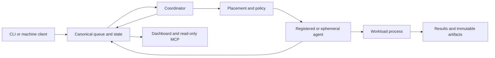

<!-- wisent-banner:start -->
<p align="center">
  
</p>
<!-- wisent-banner:end -->

<!-- wisent-readme-signals:start -->
[](https://github.com/wisent-ai/stado) [](https://github.com/wisent-ai/stado/issues) [](https://wisent.com) [](https://discord.gg/qRjpkthq54) [](https://www.linkedin.com/company/wisent-ai/) [](https://x.com/wisentai) [](https://calendly.com/lbartoszcze)
<!-- wisent-readme-signals:end -->

# Stado: The Easiest Harness for Managing Compute and Storage Across Local, GCP, AWS, and Azure Infrastructure

Stado Is the AI DevOps and Infrastructure Hire You Needed.

Your AI is super smart but confined to your computer. Stado is the missing
harness it needs to set up and manage civilisation-level infrastructure.

Spin up experiments in seconds on a dedicated GPU. Manage GCP, Azure and AWS
services from one intuitive client. Rent your local devices. Optimise storage and
migrate services across locations. Dozens of providers. Millions in available
hardware. All accessible through one simple client.

Give your AI the muscle it needs.

[Quick start](#quick-start) · [Product boundaries](docs/product-boundaries.md) ·
[Core use cases](docs/use-cases.md) · [Interfaces](docs/interfaces.md) ·
[Operational model](docs/operational-model.md) ·
[Native builds](https://stado.wisent.com/docs/builds) ·
[CLI reference](https://stado.wisent.com/docs/cli) · [Architecture](https://stado.wisent.com/docs/architecture) ·
[Operations](https://stado.wisent.com/docs/operations) ·
[Checks that measure nothing](https://stado.wisent.com/docs/checks-that-measure-nothing)

Current proof boundary: the 0.5 contract has a stable local-filesystem execution
scope for macOS arm64 and Linux amd64 release candidates. Cloud storage and VM
adapters remain preview until their release-scoped live acceptance evidence is
recorded.

## Problem and intended users

AI compute fleets usually grow as disconnected local workstations, long-lived
servers, cloud VMs, provider consoles, scripts, queues, artifact stores, and
billing dashboards. The result is expensive capacity that is difficult to
schedule, difficult to recover, and dangerous to automate.

Stado serves three audiences:

- **Infrastructure operators** need one place to admit machines, control
  mutations, observe health, pause work, recover state, and account for cost.
- **AI workload owners** need reproducible execution, explicit resource and
  deadline constraints, immutable inputs, scoped secrets, and durable results.
- **Automation and AI agents** need stable JSON contracts and bounded
  capabilities instead of shell access or cloud-administrator credentials.

Stado replaces ad hoc orchestration with a provider-neutral product contract:
describe the workload, required capacity, deadline, data, and budget; Stado
decides where and when to run it, then records what happened.

## Product boundaries

What the 0.5 contract includes, what it excludes, and what each provider
integration may claim: [Product boundaries](docs/product-boundaries.md).

## Core use cases

Who does what with Stado, and what the product records:
[Core use cases](docs/use-cases.md).

## How Stado works



The canonical object store contains job records, leases, capacity broadcasts,
control state, results, artifact manifests, and recovery metadata. Storage is
authoritative; provider APIs and dashboards are observations, not alternate
queues.

The normal lifecycle is:

```text
submit
  -> queued
  -> leased/claimed
  -> running
  -> completed | failed | cancelled | yielded
  -> results and artifact evidence
```

Every mutable transition identifies its writer and expected prior revision.
Provider-side instances, disks, and addresses remain subject to ownership
labels, policy, and bounded recovery actions.

Trust boundaries:

- callers authenticate to the exact human or machine interface they use;
- provider adapters receive only their provider-scoped identity;
- workload secrets resolve from Skarbiec at execution time;
- public release readers can read only immutable release objects;
- dashboard and MCP reads do not inherit mutation authority.

See [Architecture](https://stado.wisent.com/docs/architecture) for components,
durable state, and trust boundaries.

## Quick start

This path uses local storage and an existing local machine. It does not require
a cloud account, cloud credential, Skarbiec, GPU, or Python.

### Prerequisites

- a supported Stado binary from an immutable release;
- a POSIX shell;
- permission to create `~/.stado`;
- the runtime required by the workload itself.

Install an exact verified release before following the
[complete onboarding path](https://stado.wisent.com/docs/onboarding). A machine joins a fleet by one
of four methods — `invite` (send a fragment, or a one-line code where the
control point is published; touch nothing either way), `adopt` (Stado
installs the key over a session you already have), `join` (the machine
announces itself) and `declare` (assert the entry, verify later) — all four
listed by `stado fleet methods` and described under
[Onboard another machine](https://stado.wisent.com/docs/onboarding#onboard-another-machine). In every
one of them the private half of the channel key stays in the operator's
credential store and only the public line reaches the machine. If you are
attaching your own computer to a fleet someone else operates, read
[Add your own machine](https://stado.wisent.com/docs/add-your-machine) instead. For source
development only, install Rust and Cargo and build from `stado-rs/`.

### 1. Create the minimal local configuration

```bash
stado config init
stado config validate
```

Expected result:

```text
~/.stado/config.json
config ok (~/.stado/config.json)
```

The generated profile selects:

- provider: `local`;
- queue storage: `~/.stado/local-storage`;
- backup storage: `~/.stado/local-backup`;
- dashboard: loopback only.

### 2. Start the local control plane

```bash
stado local-control-plane
```

Expected result: the coordinator, local agent, and dashboard remain running.
The dashboard listens on `http://127.0.0.1:8765`.

### 3. Submit a job from another terminal

```bash
stado submit --run-id quickstart-hello "printf 'hello from Stado\n'"
```
`--run-id` is a required caller-retained retry identity. Reusing it with the
same request recovers the original job; use a new value for intentional new work.
The final output line is a `stado.submission-receipt.v3` JSON object. Each job
binds its exact command SHA-256, durable job key, output URI, pinned host, and
resolved executor projection to the request/source/input digests.

The command prints a `Job ID`. Use it below:

```bash
stado status JOB_ID
stado results JOB_ID ./results
```

Expected result: the job reaches `completed` and `./results` contains its
command output and result evidence.

If any step fails, run `stado doctor --fix-hints` and follow the
[onboarding failure guidance](https://stado.wisent.com/docs/onboarding#failure-guidance).
Do not add cloud credentials to make the local path work.

## Primary interfaces

The CLI, the machine-readable output, the dashboard and the desktop screens,
and what each one may say: [Interfaces](docs/interfaces.md).

## Operational model

Configuration, storage, placement, retries and what is reported when
something is wrong: [Operational model](docs/operational-model.md).

## Project status and support

Stado 0.5 is in release-candidate validation. The Rust control plane, CLI,
agents, local workflow, four storage backends, and cloud VM adapters exist.
Stable 0.5 support is intentionally limited to the local execution and local
filesystem contracts; every cloud adapter remains preview until its own
release-scoped live acceptance matrix passes.
Provider status printed by the installed build remains authoritative.

Compatibility before 1.0:

- persisted formats and machine schemas are versioned and migrated
  deliberately;
- a minor release may add fields and capabilities;
- incompatible behavior requires release notes and an explicit migration;
- preview integrations may change within the documented compatibility range.

Support:

- operational and product defects:
  [GitHub Issues](https://github.com/wisent-ai/stado/issues);
- security vulnerabilities: use a private
  [GitHub Security Advisory](https://github.com/wisent-ai/stado/security/advisories/new)
  and do not open a public issue;
- release, compatibility, and rollback policy:
  [stado.wisent.com/docs/release](https://stado.wisent.com/docs/release).

Documentation:

- [Release and compatibility](https://stado.wisent.com/docs/release)
- [Onboarding](https://stado.wisent.com/docs/onboarding)
- [Add your own machine](https://stado.wisent.com/docs/add-your-machine)
- [Examples](https://stado.wisent.com/docs/examples)
- [Architecture](https://stado.wisent.com/docs/architecture)
- [Integration contracts and lifecycle](https://stado.wisent.com/docs/integrations)
- [CLI reference](https://stado.wisent.com/docs/cli)
- [Configuration and credentials](https://stado.wisent.com/docs/configuration)
- [Operations](https://stado.wisent.com/docs/operations)

Stado is licensed under the Apache License 2.0. See [LICENSE](LICENSE).