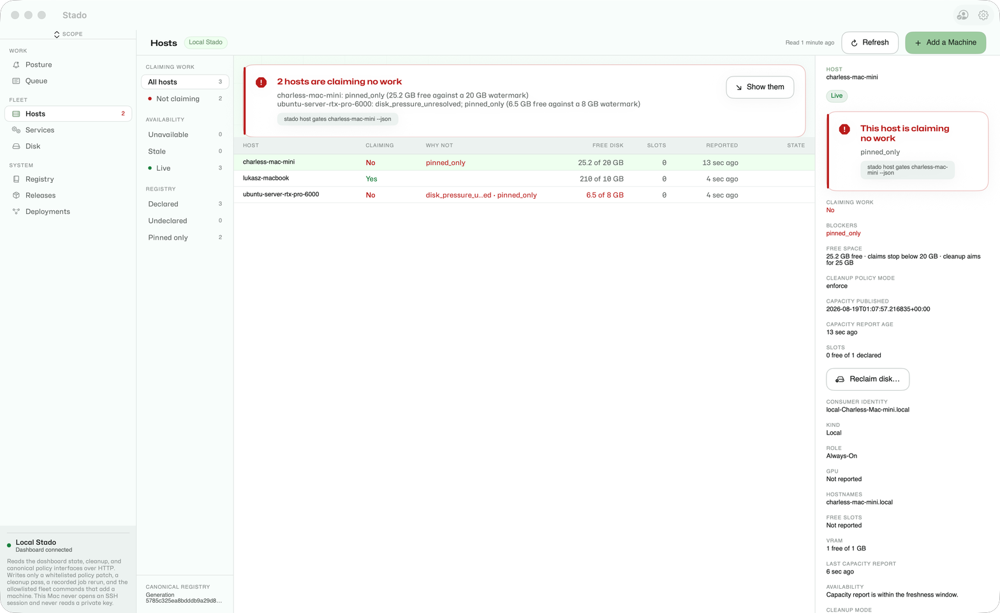
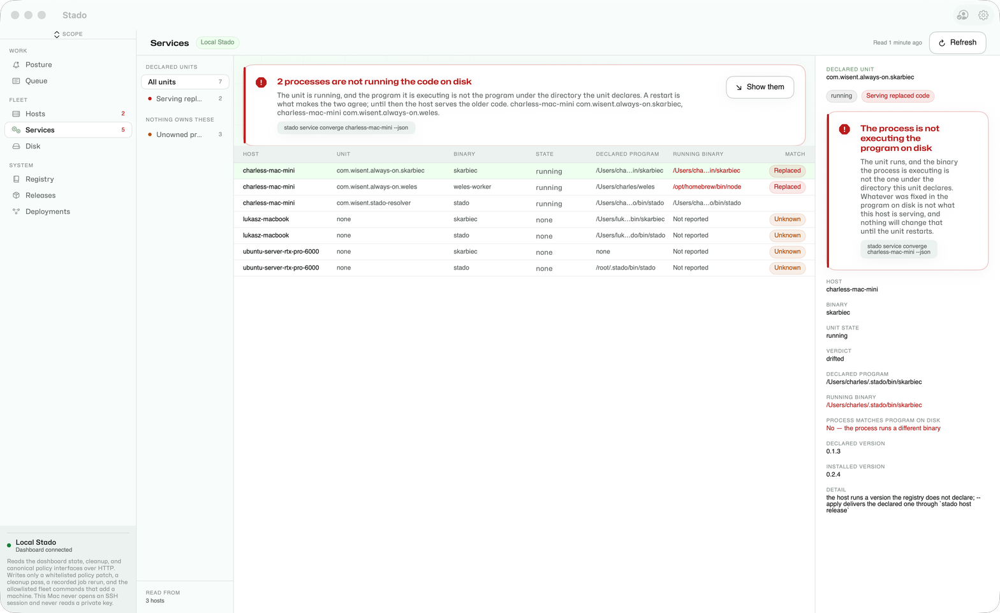
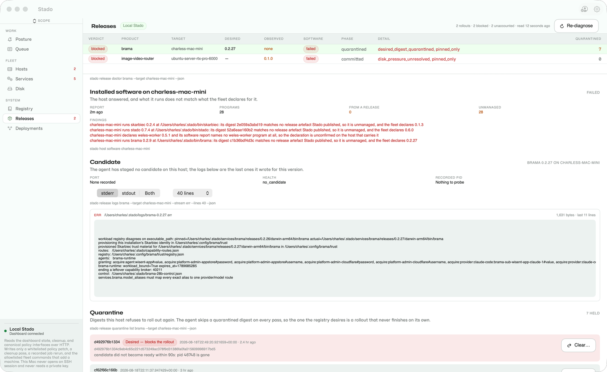

# Onboarding

This path takes a new operator from no Stado state to one completed local job. Local mode needs no cloud account, provider CLI, or Wisent production credential.

## Install an exact release

Set the immutable release identity, run the verified installer, and expose its binary directory:

```bash
export STADO_API_URL=<your-control-origin>
export STADO_RELEASE_VERSION=<exact-version>
export STADO_RELEASE_PLATFORM=<exact-platform>
./install-stado.sh
export PATH="$HOME/.stado/bin:$PATH"
```

Expected result: the installer prints `installed Stado <version> for <platform> in <directory>`. It rejects a manifest identity mismatch, missing artifact, digest mismatch, or checksum-list mismatch before replacing a binary.

Running `stado` without arguments prints the first-run path and exits successfully. It does not create config or mutable state.

## Create the minimum local configuration

```bash
stado config init
stado config validate
stado doctor --fix-hints
```

Expected results:

- `config init` prints the path to the new `$HOME/.stado/config.json`;
- the file selects only the local compute provider, local primary and backup storage, no remote deployment binding, and loopback dashboard binding;
- `config validate` prints `config ok (<path>)`;
- `doctor --fix-hints` reports actionable missing workload dependencies without requiring cloud credentials.

`config init` never overwrites an existing file. For a legacy config without a schema marker, use `stado config migrate`; it preserves the exact prior document as a timestamped sibling before adding the current schema. Production Wisent policy, verifier allowlists, and cloud credentials belong in explicit deployment profiles under `deploy/`, not in first-run config.

## Start the control plane

```bash
stado local-control-plane
```

Expected result: the process starts the queue coordinator, local worker, and loopback API listener. Leave it running; do not expose it publicly without the documented deployment authorization boundary. The listener serves no page — inspect the fleet with `stado overview` or Stado Desktop.

## Submit and inspect one job

From another terminal using the same config:

```bash
stado submit "printf 'hello from Stado\n'"
stado status <job-id>
stado results <job-id> ./stado-result
```

Expected result: status progresses from queued or running to completed. The downloaded command output contains `hello from Stado`; the result manifest records the artifact size and SHA-256. A failed job remains inspectable and may still publish logs and partial artifacts.

## Onboard another machine

A machine enters this fleet by one of **four methods**. All four are first-class, each one is available both from the CLI and from Stado Desktop, and `stado fleet methods` prints them together with the registry's own verdict on each:

```bash
stado fleet methods
stado fleet methods --json
```

### Choosing a method

| Method | The operator needs | The machine needs | Choose it when | It will not |
|---|---|---|---|---|
| [`invite`, offline fragment](#the-offline-mode) | to mint the key, send a fragment down whatever channel already reaches the machine's owner, and wait for one address back; no access to the machine at all | a terminal its owner can paste into, and Remote Login on before you enroll — no HTTPS, no `curl`, no reachable control point | the machine belongs to somebody else, or you have no way in — a laptop, a colleague's desktop, a box behind someone else's NAT — and it cannot reach this fleet's control point | announce itself: no request appears under `fleet pending`, because you close the invitation yourself with `fleet enroll --ssh <address> --bootstrap`, which still probes |
| [`invite`, one line](#the-one-line-mode) | to mint one code and send a single line; no access to the machine at all | to run that one line once, with outward HTTPS to a control point that actually answers `/join.sh` — either a published deployment or [an entrance `stado fleet ingress up` stands up in one command, with no Cloudflare credential at all](#what-the-one-line-mode-needs-and-how-to-stand-it-up) | the control point is published and reachable from the machine itself; `fleet invite` proves that before printing the line, and falls back to the fragment when it cannot | register anything by itself: a redeemed invite is a `pending` request until you approve it, and approval still probes the machine |
| [`adopt`](#adopt) | an SSH session that already opens today — agent, your own key, or the machine's own password prompt | Remote Login (`sshd`) enabled and your account able to write `~/.ssh/authorized_keys` | you can already log in: your own box, a fresh cloud VM, a rented or colocated host | help with a machine you cannot log into; it needs a working session before it can install the key |
| [`join`](#join) | only to answer the request | the Stado binary and credentials for the fleet's store already present | the machine already carries fleet credentials — a reimaged host, a rebuilt worker, a machine that was in the fleet before | bring in a stranger's machine: without store credentials there is nothing to announce with |
| [`declare`](#declare) | the machine's exact hostname and release platform, asserted by you | nothing at the moment of declaration | you are recording a machine you will verify later, or repairing a registry entry | prove anything — it performs no probe, so a wrong assertion stays wrong until something else reads the machine |

`invite` and `adopt` are the two paths that need no prior key on the machine and are therefore the normal answers. Of `invite`'s two modes, the offline fragment is the one that needs nothing published on the network, and `fleet invite` selects it for you when the control point does not answer. `join` and `declare` are the paths for a machine that already has credentials, or for a registry write with no machine involved yet.

A method the registry's enrollment catalog denies is still listed, marked unavailable and named with the field that denies it — `registry.enrollment.allow_invite`, `allow_adopt`, `allow_join` or `allow_enroll`. `declare` has no gate. `stado fleet catalog` prints the same catalog in full; a registry with no `enrollment` section leaves every method allowed.

### Which way the key travels

One property holds in all four methods, and it is the property to check when reading any of them: **the fleet dials the machine, so the machine only ever receives a public key.** The ed25519 pair is minted by `stado fleet key generate <name>` into the operator's Skarbiec as the `stado-ssh-<name>` item. The private half is stored there, never printed, never transmitted, and never written to the machine being added; no method asks the machine to generate a pair of its own, and no method sends a private key anywhere.

What lands in the machine's `~/.ssh/authorized_keys` is exactly one public line, and it is the same line whichever method put it there — whether a person pasted it, whether `adopt` wrote it over a session the operator already had, or whether the machine fetched it from the dashboard with an invite token. Afterwards `stado fleet key ls` shows stored keys as metadata only and `stado fleet key check <name>` proves the channel actually opens.

### `invite`

The operator mints the machine's channel key and never touches the machine. The method has **two modes**, and which one applies is not a preference: it is whether the machine being added can reach this fleet's control point.

```bash
stado fleet invite --name <target-name>             # probe the control point, then pick the mode
stado fleet invite --name <target-name> --offline    # do not probe: fragment only
```

`--name` is optional: without it the target is named `invited-<first 8 hex of the invite id>`, and a name that collides with an existing target or another open invite is a hard error asking for `--name` rather than a silent suffix. Both modes mint `stado-ssh-<target-name>` through the same `fleet key generate` path and print its fingerprint, both accept `--expires <duration>` and `--uses N` — a duration is an integer plus one of `s`, `m`, `h`, `d`, and a bare number is refused rather than guessed; the default is one use and 24 hours — and in both the private half stays in the operator's Skarbiec.

Before it prints anything, the command works out the control address and fetches `/join.sh` from it. Three sources are tried in order: `STADO_ENROLLMENT_URL` / `enrollment.url` if configured, then the entrance `stado fleet ingress` has published and verified (`enrollments/ingress.json`, used only while its address still answers), then `STADO_API_URL` / `api.url`. No control host is compiled into Stado, so an address nobody configured and nobody published is a reason to fall back, not a name to invent. If the address does not resolve, or refuses the connection, or answers `/join.sh` with anything other than `200`, **the one line is not printed at all**: those three cases are reported apart — a missing DNS record, a missing listener or tunnel, and a release too old for the routes are three different repairs — and the command continues in offline mode. [The control-point check](cli.md#the-control-point-check) is the exact list of verdicts.

[`fleet/invite-a-machine.sh`](examples/fleet/invite-a-machine.sh) is this method end to end from the operator's side, offline mode first.

#### The offline mode

The mode that works today, and the default for any machine that cannot reach the control point. It mints no token and needs no HTTP route at all: the carrier is the channel you are already using to talk to whoever holds the machine.

`stado fleet invite --name <target-name> --offline` prints a self-contained `sh` fragment between two markers. Pasted into a terminal on the machine by its owner, it creates `~/.ssh` at mode 700 and `~/.ssh/authorized_keys` at mode 600, appends the fleet's **public** line there idempotently — the line is *inside* the fragment, not fetched from anywhere — reports whether anything answers on port 22 and prints the exact **System Settings › General › Sharing › Remote Login** path, or its Linux equivalent, when nothing does, and ends by printing the `user@address` its owner sends back to you.

The fragment is not a secret, and it says so in its own output: the only key in it is a public one, so reading it gains nobody anything. That sentence is there for a reason. A fragment treated as a credential gets routed down whichever channel feels secret rather than the one that actually reaches the machine's owner, and then the invitation simply stalls.

The invite object lands in `enrollments/invites/<id>.json` with `mode: "offline"`, status `open`, and no `secret_sha256`, because no secret exists. `stado fleet invites` reports it as `open (offline, awaiting address)` — the one state in this lifecycle that waits on a person rather than on a clock. When the address arrives, the operator closes it with ordinary probe-then-write enrollment:

```bash
stado fleet enroll <target-name> --ssh <user@address> --bootstrap
```

That is `adopt`'s command *without* `--install-key`, and it works precisely because the key is already in place: enrollment reads `hostname`, `uname -s` and `uname -m` over the channel, writes the entry from what it read, installs the agent, and rolls the entry back if that install fails. The invitation is then `spent`. There is no `fleet pending` step, because nothing self-reported: an offline invitation produces no request to approve, and the operator's own enrollment is the registry write.

#### The one-line mode

Available only when the check above succeeded. The command then prints the token once — `<id>.<secret>`, a 16-hex id and 32 CSPRNG bytes in unpadded base64url — states that nothing can reprint it, names the minted channel key's fingerprint, and gives the single line to forward to whoever holds the machine:

```text
curl -fsSL <control-point>/join.sh | sh -s -- <id>.<secret>
```

`<control-point>` is the address that just answered the check, never a name built into Stado. When it came from `stado fleet ingress`, the command says so and repeats what that means: the address is a temporary Cloudflare quick tunnel, the one-liner dies with the ingress, and a restarted ingress comes back under a different address, so an invitation handed out before a restart is dead. The store keeps only `secret_sha256`, in `enrollments/invites/<id>.json` alongside `target_name`, `created_at`, `expires_at`, `uses_allowed`, `uses_spent`, `status`, `created_by` and the `mode` that distinguishes the two kinds of invitation. `stado fleet invites` lists live invites with their status and spend, and `stado fleet revoke-invite <id>` closes one immediately. `--json` carries the same token in `token` next to the ready `join_command` — plus `base_source` and `base_is_temporary`, so a script can tell a durable origin from a tunnel — so redirecting that output to a file writes a live credential to disk; nothing can reprint the token if it is lost, and the answer to a lost token is a new invite plus `revoke-invite`.

On the machine, that one line fetches `GET /join.sh`, reads the fleet's **public** key from `GET /api/fleet/invite/key`, appends it to `~/.ssh/authorized_keys`, and announces the machine through `POST /api/fleet/join` with the hostname, OS, architecture, the destination it worked out for itself, the fingerprint it installed, and whether its SSH channel was answering. Both API routes are authorized by the invite token alone and neither can write the registry; the script itself carries no secret, because the secret is the argument the user supplies, and it installs no software — the agent arrives with your approval. See [the invite endpoints](cli.md#invite-endpoints-on-the-dashboard) for the exact contract.

The machine is then a pending request, exactly like `join`, and the operator finishes it:

```bash
stado fleet pending
stado fleet approve <hostname>
stado registry beacon-age
```

`stado fleet pending` shows, for an invited request, the `channel` destination approval will probe, the `invite` id it came from, the fingerprint of the key the machine installed, and whether that machine's SSH channel was answering when it reported; `--json` emits the same. Approving a machine whose channel is not answering yet is the one wasted round trip this view prevents. `approve` then takes that destination and runs the same probe-then-write enrollment as every other path — it reads `hostname`, `uname -s` and `uname -m` over the channel before writing, and rolls the entry back if the agent install fails. Approval is not a shortcut around verification. A spent, expired, revoked or unknown token is refused identically, without telling the caller which of those it was.

The machine is registered under the invitation's target name — the one `--name` reserved, which is also the name the owner's terminal printed and the name whose key the invitation minted — so `stado fleet key check <target-name>` and `stado host recover <target-name>` afterwards use that name, not whatever local hostname the machine happens to have. Its hostname is not discarded: it lands in the entry's `hostnames`, probed rather than trusted. `stado fleet approve` addresses the *request*, and a request is keyed by hostname; that is why the two arguments differ, and why `fleet pending` prints both.

#### What the one-line mode needs, and how to stand it up

The one-line mode needs one thing the offline mode does not: an origin the machine being added can actually reach over HTTPS, serving `/join.sh`. That is not something an invitation can conjure, which is why `fleet invite` proves it before printing anything. There are two ways to have it.

**The published deployment.** A DNS record for the control host pointing at something that terminates TLS, an authenticated reverse proxy in front of the loopback bind the dashboard keeps by design, and a release on that host new enough to serve `GET /api/fleet/invite/key`, `POST /api/fleet/join` and `GET /join.sh`. All three, or the check reports which one is missing: a name in no zone fails as a name that does not resolve, a loopback-only bind fails as a refused connection, and an older release answers non-`200` and fails as an unknown route. Point `STADO_ENROLLMENT_URL` at it and every invitation uses it.

**`stado fleet ingress`, which needs none of that.** One command stands the entrance up with **no Cloudflare account, no API token and no DNS record**:

```bash
stado fleet ingress up          # stand it up and verify it from the internet
stado fleet ingress status      # what is published, whether it still answers, how old it is
stado fleet invite --name <target-name>
stado fleet ingress down        # close it when the machine has joined
```

`up` picks its own free loopback port, starts `stado dashboard --enrollment-only` on it — the listener that serves those three routes and answers `404` to every other path and method, before authorization, before the store and before the vault — and starts a Cloudflare quick tunnel in front of it. It then fetches `/join.sh` back **through the public address, from the internet**, and compares the bytes with the script this binary would have served. Only a match publishes `enrollments/ingress.json`; anything else stops both processes and reports the stage that failed. There is no state in which the command claims an entrance that is not there.

Three things about that tunnel, all of them said by the command itself:

1. **Cloudflare calls quick tunnels non-production and rate limits them.** That is an acceptable trade for an entrance used a handful of times a month to add a machine, and it is not one for anything a service depends on.
2. **The address changes on every start.** Stopping and restarting the ingress invalidates every one-liner already handed out. Keep it standing until the machine has joined; `fleet invite` repeats this whenever it builds a one-liner on an ingress address.
3. **`--named` is refused today**, and not because something needs configuring: a named tunnel on the fleet's own domain wants a Cloudflare API token, the vault has no `platform-admin-cloudflare#api_token` field, and Skarbiec refuses to grant on a field that does not exist. There is nothing to set until that item exists.

`ingress up` will not adopt a port it did not open. `--port N` on a port already in use is refused before any process starts, because putting a public tunnel in front of somebody else's service is the one mistake this command must never make.

Without either of the two, the fragment remains the way a machine is added — and it remains a perfectly good way.

### `adopt`

When the operator can already open a session on the machine, Stado installs the public key itself instead of asking a human to paste it:

```bash
stado fleet enroll <target-name> --ssh <user@host> --install-key --bootstrap
```

`--install-key` is first contact: it mints `stado-ssh-<target-name>` if that item has no pair yet, then appends the public line to the machine's `authorized_keys` over whatever access plain `ssh <user@host>` already has — an agent, one of the operator's own keys, or OpenSSH's interactive password prompt. Stado never reads, stores or forwards a password, and again only the public half travels. A second run reports the line already present rather than appending a duplicate.

The three ways first contact can fail are reported apart — never connected, connected but authentication rejected, authenticated but the `authorized_keys` write failed — and all three abort before any registry write. Once the key is in, the run continues on the unchanged enrollment path: probe, then write, with `--bootstrap` rolling the registration back if the agent install fails.

`stado fleet key install <target-name>` is the related but different tool: it appends the stored public key *through an existing Stado channel*, so it rotates and repairs, and is not first contact.

### `join`

When the control plane cannot reach the machine but the machine can reach the fleet's store, the machine announces itself. On the machine:

```bash
stado fleet join
```

On the control plane:

```bash
stado fleet pending
stado fleet approve <hostname> [--fleet <name>]
stado fleet reject <hostname>
```

This is the same request object and the same approval as `invite`, and it needs the same probe on approval. The difference is who authenticated the announcement: `join` requires the machine to already hold the Stado binary and credentials for the store, while `invite` replaces both with a single-use token.

### `declare`

The lower-level write skips the probe and records what you assert:

```bash
stado registry host add <target-name> --ssh <user@host> --release-platform <exact-platform>
stado registry doctor
stado bootstrap --target <target-name> --dry-run
stado bootstrap --target <target-name>
stado host health <target-name>
```

`--ssh` and `--release-platform` are both required; `--kind` defaults to `local`. Nothing here reads the machine, so `registry doctor` is what later diffs the declaration against live state. Review the dry-run unit before installation. The worker host must already provide every runtime and driver its jobs require. Registry identity, SSH reachability, workload dependencies, and health publication are separate checks; passing one does not imply the others.

For the current machine, `stado bootstrap --local --target <target-name>` installs
the launchd or systemd-user unit directly.

### Any reachable destination counts

The registry stores the SSH destination verbatim and requires no particular kind of address. `user@machine.local` on the same LAN is as valid a target as a tailnet name or a routable host; enrollment probes whatever you give it and records the machine it actually reached. With `invite`, the destination comes from the machine itself, in the `destination` field of its request.

A `.local` destination costs reach, not correctness. Every command that opens the channel — `stado fleet enroll`, `stado fleet key check`, `stado host recover`, `stado host exec`, `stado bootstrap` — then works only from inside that network and fails with an unreachable destination from anywhere else. The health beacon travels the other way: the host publishes it outward itself, so `stado registry beacon-age` and `stado host health <target>` keep reporting that machine from anywhere, including while its channel is out of reach. Registering a machine by its `.local` name is therefore a complete way to attach it and watch it, and an incomplete way to administer it remotely.

### After any method: the channel and the grants

Whichever method registered the machine, the same three commands turn it into a reporting host, and the last one is the proof:

```bash
stado fleet key check <target-name>
stado host recover <target-name>
stado registry beacon-age
```

A reporting host also needs its two Skarbiec grants, which the control plane mints:

```bash
skarbiec token-mint stado-local-agent --scopes 'read:*'
skarbiec token-mint stado-host-health-beacon --scopes 'read:stado-host-health-api'
```

`stado fleet key check` proves the channel, `host recover` installs the health beacon and the managed units, and `beacon-age` is the proof — a target with no beacon at all is listed, never omitted.

### The same four methods without a terminal

Stado Desktop offers all four: **Fleet › Hosts**, the **Add a Machine** action, then a chooser that lists `invite`, `adopt`, `join` and `declare` with the same requirements and the same registry verdict `stado fleet methods` reports, and one sheet per method. It issues the `stado fleet …` commands documented here rather than carrying its own enrollment logic, so the CLI remains the canonical surface and the two cannot disagree. The `stado_fleet` binary still exists for compatibility over the same implementation; new instructions should use `stado fleet`.

If the machine belongs to somebody else, hand them [Add your own machine](add-your-machine.md), which is written for their side of `invite` and nothing more.

## Reading the fleet from Stado Desktop

Once a machine reports, three screens answer the questions that used to need an SSH session. Each one runs the `stado` commands documented in [the CLI reference](cli.md) and shows their answers; build the app with `desktop/StadoDesktop/scripts/build-app.sh`. The screenshots are live reads of the Wisent fleet.



*Hosts — read why a host is claiming no work: the blockers its own agent publishes, its free space against the enforced watermark and the age of its capacity report (`stado host gates`), and preview-first disk reclamation (`stado host reclaim`).*



*Services — read what the host is actually running against what it declares, including the binary each process is really executing (`stado service converge`), and the product processes no unit owns (`stado service list --unowned`).*



*Releases — read why a rollout is stuck: the verdict and blockers (`stado release doctor`), the candidate's own stderr off the host (`stado release logs`), and the quarantined digests with the desired one first, which is where a digest is cleared with a typed reason (`stado release quarantine list|clear`).*

## Failure guidance

- `config file already exists`: validate or migrate it; do not overwrite it implicitly.
- `ERROR config schema_version ...`: run `stado config migrate` only for a trusted legacy config. Future schema versions require a compatible Stado release.
- storage unreachable: stop submission, preserve the source, and follow `stado storage backup`, `stado storage verify`, or the outage recovery procedure. Unreachable storage is never treated as an empty queue.
- job remains queued: confirm an eligible worker is running, the queue is not paused, capacity fits, and the workload deadline has not expired.
- worker rejects or fails a job: install the requested shell/runtime/driver on that worker or change the workload. Stado does not silently supply workload dependencies.
- API authorization error: each route family (object, release, machine, service, host-health) resolves its own scoped bearer; check the grant for the route being called. Do not bypass or disable the authorization boundary.
- immutable release collision or digest failure: stop. Publish a new version; never overwrite the existing coordinate.

## Uninstall and local reset

The uninstall script requires an explicit confirmation value and preserves config and queue data by default:

```bash
STADO_UNINSTALL_CONFIRM=uninstall-stado ./uninstall-stado.sh
```

It disables Stado launchd/systemd-user services, removes installed Stado binaries, and leaves `$HOME/.stado/config.json`, local storage, and local backup intact.

To remove those local data stores and config as well:

```bash
STADO_UNINSTALL_CONFIRM=uninstall-stado ./uninstall-stado.sh --purge-data
```

`--purge-data` is irreversible. Before using it, stop all writers and copy any queue, results, artifacts, or configuration that must survive. It does not delete cloud objects or credentials outside the local Stado paths.
